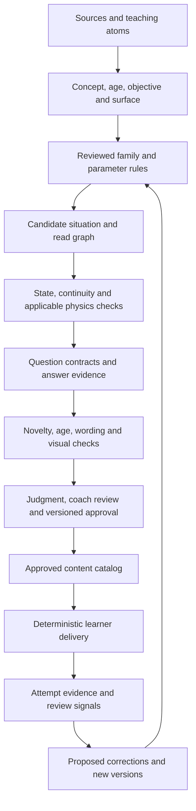

# SGS: a factory for thousands of useful questions

**Date:** 2026-09-05. **Status:** source-backed design draft for planning with Thomas; no batch generated, no new approval or live-bank admission. Implementation status below is a repository snapshot, not a claim of released functionality.

## The approach

Build a **reviewed family of situations once, then generate eligible variations and several ways to demonstrate understanding**. The engine should not ask a language model to invent a thousand unrelated hockey questions. Its reusable unit is a teaching objective, a visible situation, the conditions that change the read, and an answer contract that explains what can reasonably count.

There are two starting tracks. **U7 foundations** introduces the rink and equipment through finding, sorting, matching and moving objects. **U11 decision training** starts with one opponent and grows into connected reads involving more teammates. The same source, identity, accessibility and review infrastructure serves both; a gear-identification answer does not need a tactical skating simulation.

Thomas has already settled the direction: the documents supply teaching content; 3D is the default rink view with an adjustable camera; children can move players and explain decisions; play continues from their actual choices; formats should vary; Learning gives feedback after each complete read and Challenge after the full play. **U11 offers both Frozen and Continuous play from the start**, without a proficiency unlock. Decisions must integrate simultaneous cues as well as follow sequential changes. U7 also explicitly includes introductory activities such as putting equipment into a bag. These latest requests supersede earlier blanket exclusions of static identification. This document develops the production system around those choices.

**Latest owner clarification: explanations are optional.** A committed position/action, including an explicit stay, can complete a read. “Why would you be there?” offers extra comprehension evidence when answered; absence is not wrong, failed or incomplete. Record whether a reason was provided, preserve its exact text when present, and do not let AI invent one or treat omission as misunderstanding. This overrides earlier position-plus-mandatory-reason wording.

**Named focus, not automatically first person:** the ring identifies the player the question concerns. Each read declares `focusActorId` and `perspectiveMode: 'observer' | 'player'`. A question may concern F1, then D1, then another valid named actor; the focus need not be the puck owner or the learner-controlled actor. Named observer prompts such as “What should D4 look to do?” are supported design scope. A recovery-to-slot answer is acceptable only when the shown threat, responsibilities, path and approved hockey context support it; the label D4 supplies no tactical answer by itself.

**Latest owner decisions:** the player rink is **3D only for now**, with adjustable angles including overhead; a failed rink offers retry rather than a tactical-board fallback. One moving situation should support seven or eight reads from different named perspectives. Drag-to-area answers may be graded against **reviewed acceptable regions with tolerance**, allowing several useful positions rather than a pixel-perfect coach dot. The [multi-perspective authoring map](2026-09-05-multi-perspective-play-sequences.md) binds an exact U18 3-on-2 opening to a proposed pass/support/shot/recovery graph with a conditional eighth read, separates it from the U15 support-board preview, audits legacy point/zone scoring reuse, and adds a motion-dependent gap-control family. These decisions authorize the design direction; they do not approve new tactical thresholds or claim a general eight-read runtime exists.

**What makes scale credible is reusable, reviewed conditions—not a large raw question count.** A defensible goal is thousands of approved question instances over a growing collection of families. That is different from thousands of meaningfully different situations or thousands generated in one day. None of those throughput claims has been established by this blueprint.

## Authority and source inventory

Use the [current SGS plan](../../one-on-one/SGS-PLAN.md), [connected template contract](2026-09-05-connected-scenario-template-engine.md), [question-variety matrix](2026-09-05-sgs-question-variety.md), [canonical engine design](2026-07-29-scenario-engine-design.md) and [owner decisions](../../factory/SCENARIO-ENGINE-DECISIONS.md). Where the July engine specification disagrees with the owner decisions, the decisions win. Research-library readiness and executable tactical approval are different statuses: the [research-library design](2026-07-10-evidence-led-curriculum-research-library-design.md) permits documented curriculum work; it does not eliminate the later engine's approval and calibration requirements.

**Latest methodological extension:** Thomas requested invasion games, a constraints-led approach and game-based basketball teaching, then asked what other sports can contribute. The [game-based lesson supplement](2026-09-05-sgs-game-based-learning.md) records inspected primary sources, a bounded basketball/soccer/rugby transfer map, U7/U9/U11 proposed lessons and exact constraint/adaptation fields. It distinguishes a teaching-method analogy from hockey tactical authority and does not claim proven cross-sport or app-to-ice transfer. Handball goalkeeper ideas remain a source-acquisition lead. Neither the new methods nor an old single-forced-answer opener remove the approved multiple-acceptable positioning format or Frozen/Continuous choice.

**Further accepted scope:** all supplied foundation formats are included: picture callouts/labels, matching, sorting, a player-bag checklist and packing, dressing a player, and fill-in-the-blank using typed or picture/word-bank answers. U7 must not depend on typing/spelling. Vocabulary progresses from naming and pointing to recognizing a term in play and explaining its relevance; optional slang is separate and age reviewed. The supplement specifies concrete examples and primary Hockey Canada equipment references. Professional-game poster rules and manager-bag supplies do not become U7/player-equipment doctrine; original art and an approved item catalog remain required.

The inspected `docs/library` contains **12 substantive notes representing eight canonical ledger concepts and narrower variants**, not 12 approved generator families. The [curriculum ledger](../../../src/data/curriculum-ledger.json) stores `concepts[].lineage` and age/depth nodes; it has no `sourceBindings` property. The inspected lineage notes are empty. A lineage label such as Hockey Canada is useful attribution, but it is not an executable claim with a page reference, conditions and exceptions.

Depth codes below are ledger emphasis: I = introduced, D = developing, M = mastery emphasis, R = refinement. They do not automatically prescribe a question's difficulty.

| Actual teaching note | Canonical ledger binding and relevant age range | Useful factory atom and source limit |
| --- | --- | --- |
| [Gap control](../../library/gap-control.md) | `gap-control`: U11 I, U13 D, U15 M, U18 R | Closing speed and available carrier options; protect inside space. Best citation trail in this subset, including named progression/pathway documents. Separate gap from inside position rather than conflating them. |
| [Defensive angling](../../library/defensive-angling.md) | Alias to `angling-steering`: U9 I, U11/U13 D, U15 M, U18 R | Steer toward less dangerous space **when inside position is already established**. No citation section; do not turn this into an unconditional rule for a beaten defender. |
| [Scanning](../../library/scanning.md) | U7 I, U9 I, U11 D, U13 M, U15/U18 R | Find an available teammate, space or arriving pressure. Note says U9 D, but ledger says I: normalize before generation. An overhead identification response is not proof of a physical shoulder check or of improved on-ice scanning. |
| [Off-puck support](../../library/off-puck-support-offense.md) | U9 I, U11 D, U13 M, U15/U18 R | Useful space **and** a usable passing lane, not proximity alone. Broad citations need precise locators. Its `0.035` legacy normalized lane tolerance is not a physical reach or metre threshold. |
| [Odd-man reads](../../library/odd-man-reads.md) | U11 I, U13 D, U15 M, U18 R | Defender commitment changes pass/shot availability. Note offers U7/U9 wording, but those odd-man ledger nodes do not exist; wording alone cannot authorize younger tactical content. |
| [2-on-1: pass lane removed](../../library/two-on-one-pass-lane-removed.md) | Variant of `odd-man-reads`, U11+ | Counterexample to “always pass.” Shooting also needs possession, a usable lane and a feasible release. No citation section. |
| [2-on-1: support too flat](../../library/two-on-one-support-too-flat.md) | `odd-man-reads` plus `off-puck-support-offense`; intersection U11+ | A teammate can be available without improving the attack. The note itself permits shooting **or** continuing the attack; this is not a unique-answer rule. No citation section or explicit tactical threshold. |
| [2-on-1: goalie late after pass](../../library/two-on-one-goalie-late-after-pass.md) | `odd-man-reads` plus skater `shooting`, U11+ for this family | Recognize a goalie still moving after a completed reception. No citation section or goalie-position curriculum node; this is a skater's shot-decision cue, not a ready goalie-training track. |
| [Backcheck recovery](../../library/backcheck-recovery.md) | U11 I, U13 D, U15 M, U18 R | Recover toward dangerous inside support **when the scene demonstrates that threat**. No citation section. |
| [Backcheck: defender gets beat](../../library/backcheck-recovery-defender-gets-beat.md) | `backcheck-recovery`, secondary `coverage-reads`, U11+ | A changed carrier threat may require a changed responsibility. Retain “may”; verify actual assignments. Heavy defensive switching belongs to the ledger's U15+ treatment. No citation section. |
| [Forecheck pressure](../../library/forecheck-pressure.md) | U11 I, U13 D, U15 M, U18 R | An approach angle can remove an outlet. The ledger flags a thin single-source lineage; the note has no citation section. Name system-dependent assumptions. |
| [Retrieval under pressure](../../library/dz-breakout-retrieval-under-pressure.md) | Alias `dz-breakout` / `dz_breakout` to `breakout-and-regroup`: U11 I, U13 D, U15 M, U18 R | Read a forechecker's commitment and the remaining escape. Has a developed sequence and an existing approved claim, but its broad practice-plans citation is still principle-level. Show the second pressure/outlet closure before treating waiting as wrong. |

Seven of the twelve notes lack a citation section. The [library index](../../library/INDEX.md) is incomplete, and [the source-corpus README](../../library/sources/README.md) still contains an unchecked consolidation checklist. These are reasons to create a source crosswalk, not to pretend the whole library has been ingested or approved.

There are ledger entries but no standalone inspected library notes for puck protection (`puck-protection`), net-front play (`net-front-play`), passing lanes (under `passing`) or support after a pass (under `off-puck-support-offense`). Neither `passing-lanes` nor `support-after-pass` is a literal ledger concept ID. U11/U13 net-front is recognition-only in the ledger, without contested net battles. There is no dedicated goalie-angle concept in the inspected ledger. Equipment packing, equipment matching and the program-specific equipment list need their own bound foundation sources; the existing tactical notes do not supply them. The later game-based supplement identifies primary equipment sources, with catalog compilation/review still outstanding.

### Retain teaching atoms, not a copied corpus

Follow the [research-library retention policy](2026-07-10-evidence-led-curriculum-research-library-design.md): Obsidian is the human-facing research index, permitted originals belong in the authorized archive, and the repository receives validated technical exports. The older `docs/library/sources` copy-everything checklist is not permission to bulk-retain restricted material.

A proposed `TeachingAtom` export records: stable ID/version; canonical concept; original short paraphrase; exact source title/URL or file identity plus page/section; permitted retention mode; age and surface applicability; conditions; exceptions; disagreements; evidence status; reviewer; and content hash. Keep source text or an excerpt only where retention is permitted. Reference paid or restricted material with citation metadata and original notes when copying is not authorized. No protected diagram, proprietary progression or source prose becomes a generated question by default. This blueprint performs no new collection or licensing assessment.

## Production architecture

This is the conceptual flow; execution preserves the canonical gate ordering. No later check may erase an earlier failure. A candidate can be mechanically valid yet remain an unapproved teaching draft.

### 1. Objective and family cards

An objective states what the learner will demonstrate, under which conditions. “Notice that F3 received the puck” is an observation objective. “Move into useful support after the pass” is a tactical application objective. They may share a scene, but one correct observation does not prove the tactical application.

A reviewed family card contains:

- Source-atom IDs, ledger bindings, age/depth, surface, allowed roster sizes, actor roles and learning objective.
- Initial possession, direction of attack, required visible cues and information intentionally unavailable to the learner.
- Parameters with units, eligible ranges/combinations and reasons each can change the read; boundary examples and exclusions.
- A bounded graph of reads and continuations, including which learner actions each continuation supports.
- Allowed question templates, prerequisite predicates, acceptable-answer rules, reason rubric and evidence limits.
- Versioned physics/claim/renderer/question/rubric dependencies; review status and calibration class.

For game-based lessons, add the [supplement's `lessonDesign` fields](2026-09-05-sgs-game-based-learning.md#proposed-sgs-fields): explicit constraint purpose and side effects, simultaneous cue sets, independent openness/challenge/practice schedule, scaffold-removal probes and logged adaptation. Changing a rule or making a rink smaller is not enough by itself to establish a constraints-led lesson. Cross-sport inspiration references remain separate from approved hockey claims.

The first authoring interface should let a coach inspect this card alongside a small set of contrasting 3D examples: a clear case, a case where the answer changes, a borderline case and an invalid setup. Moving one player should show which declared relationship changed. It should never announce that an arbitrary drawing is tactically correct simply because it can animate.

### 2. Meaningful parameter rules

Enumerate a finite eligible parameter space using the existing [parameter-space module](../../../src/scenario-engine/generator/parameterSpace.js). Prefer controlled contrasts: change the defender's commitment while holding the rest understandable; then change support depth; then combine interactions that have been reviewed together. A `loadBearing: true` label alone proves nothing.

For hockey families, novelty concerns cue/decision relationships: which route is threatened, which player has possession, who can receive in time, which viable actions remain, what changed from the previous read, and what evidence supports the reason. For foundations, it concerns the recognition/sorting objective and eligible target set. Rotating the rink can help recognition transfer, but it does not create a new rink feature or a new hockey situation.

Keep three kinds of thresholds separate:

| Threshold | What it may decide | What it must not claim |
| --- | --- | --- |
| Input tolerance, with screen/scene units | Whether a small finger tap selected the intended visible object | Hockey correctness or stick reach |
| Physical feasibility, with sourced age/skill profile and units | Whether an action can occur in the shown time/space | That the physically possible action is the best tactic |
| Family cue / novelty boundary, versioned and calibrated | Whether this contrast changes relevant evidence or warrants a distinct instance | A universal metre-based definition of good positioning |

The current [novelty implementation](../../../src/scenario-engine/noveltySignature.js) has 2 m / 0.3 s constants explicitly flagged as judgment calls. Do not reuse them as tactical answer thresholds or assume a smaller change cannot open a lane. Family-level relation changes need boundary testing before those constants are suitable for that family's counting. The support note's normalized `0.035` and mixed preview's 0.5 m distance-description tolerance likewise cannot become a positional score.

### 3. State and sequential causality

Use the canonical `ScenarioDefinition → SimulationTrace → DecisionEvaluation → CompiledTeachingPlay` pipeline for validated moving plays. One definition carries one age/skill physics profile; an older-age trace cannot validate a younger sibling. All rink renderers use the same authoritative position, orientation, stick/puck state and timing. The camera changes the presentation, never the answer coordinates or “forward/back” meaning.

Each read binds to the **actual entry freeze and history**, then records the learner's response. A transition consumes the answered state, including the exact chosen player position. It cannot reset to the family's preferred layout. Record carries, pass release, puck flight, reception, loose puck, recovery and shot as distinct events. Ownership changes at the supported event, not at a caption or button click.

Free placement creates a continuum of possible states; prewriting every branch is neither feasible nor necessary. Use a bounded set of reviewed transition rules that operate on the actual state. Validate that actual continuation before playing it. If the position blocks a required route or the next event is unsupported, keep the answer and enter an adjustment/discussion state. Never silently move the learner's player or invent a recovery to reach the next question. Open positioning does not get deterministic tactical grades until its approved rubric covers that case.

Branch limits are a content policy: a family declares supported response/transition classes and a maximum read depth. The current three connected reads remain three reads; an observation prompt followed by placement and why belongs to one read. A new question requires new evidence or a distinct comprehension objective, not another click on an unchanged freeze.

**Role handoffs and variable lengths are now explicit requirements.** A 2-on-1 can continue from F1's pass through actual F2 reception, then hand learner control to D1 for placement/why, then continue from that chosen defensive position. Separate `learnerControlledActorId`, `observedActorIds`, `actingActorIds` and `puckOwnerId`; record the handoff's trigger event, state/time and visible neutral role cue. Stable actor identities survive the changing `YOU` alias. Do not reset F1/F2 to staging positions, turn in-flight puck into possession, or assume moving D1 guarantees an outcome. Families declare allowed handoffs, terminals and maximum depth; three reads is the initial pilot, not an engine-wide limit. A general multi-role, variable-length runtime remains a planned extension rather than a claim about the current frozen-read preview.

Changing the named question focus is distinct from transferring control. Bind `focusActorId`, `perspectiveMode` and the permitted response actor(s) to the read; record any actual control handoff separately. Observer mode can ask the learner to place a named player without pretending the learner is that player. The ring, named prompt and answer target must agree, while camera angle changes none of these fields. Use `YOU` only for explicitly authored player-perspective copy and retain the stable actor ID underneath. Focus changes must follow a reviewed role/objective mapping and real roster—not random actor selection. A 3v3 family cannot invent D4. If identifying an actor is itself the answer, do not reveal that answer by pre-highlighting it. A shared focus contract and named D1 extension are current implementation work; a general dynamic D4 curriculum is not built or approved.

### Simultaneous cues, sequential reads and two pacing modes

These are separate design dimensions:

- **Simultaneous:** at one timestamp, the learner may need to relate the defender's stick/lane, the teammate's availability and the goalie's visible position. One decision integrates those cues. It does not require simultaneous clicks or several children controlling roles at once. Age-appropriate cue load determines how many relationships the family presents.
- **Sequential:** after that decision, the actual play changes. A completed pass, a carrier's turn or changing pressure creates the next read. Each read must preserve the prior action's consequences and ask about the new evidence. Three unrelated multiple-choice prompts do not become three connected reads by numbering them.

Frozen and Continuous use the **same canonical family, objectives, state/history and response rules**. A camera or pacing switch cannot swap in a different answer key. Feedback timing is a second independent setting:

| U11 pacing | Learning feedback | Challenge feedback |
| --- | --- | --- |
| **Frozen** | Pause at each intended read; confirm the response, with optional reason; then show feedback and continue. | Pause for each response; preserve all answers and any optional reasons; show feedback after the play. |
| **Continuous** | The play advances while the decision window is open. Commit a response against its actual timestamp/state; after that read's defined boundary, pause briefly for reflection/feedback before continuing. | The play advances through supported decision windows. Record timestamped responses/events and show feedback after the play. |

The exact decision windows and opportunities for replay/help belong to each reviewed family. A continuous response records the actual state at commitment, not the state from when the prompt first appeared. If a pass lane closes, the engine cannot score the response against the old opening. A placement in continuous play is a movement intent that follows a validated route/time model; it cannot teleport a player into the target. Frozen arrangement remains a distinct planning input, with its own declared transition contract.

Time passing is not an answer. An unanswered window records `no-response` or a supported default **game event**, with no invented child choice or explanation. Explain the result gently; do not infer low comprehension from motor speed, reading time or use of an accessible input. U7 foundation activities remain untimed. Pauses, hints and replays are recorded delivery conditions rather than secret penalties. Continuous access is available from the start; it is not a reward for passing Frozen mode.

**Current implementation limit:** mixed SGS freezes for answers and automatically animates authored continuations. It does not yet implement continuous learner decisions. Both approved U11 pacing modes therefore require explicit work in the next implementation plan, alongside the already implemented Learning/Challenge feedback distinction.

The goalie/shooting game should become a **read-the-chance family using these same question and sequence contracts**: the learner acts because of the visible puck, defender, teammate and goalie relationships, then reads the supported continuation. Aim alone is not evidence of tactical comprehension. The existing goalie-late note offers one skater decision cue; a goalie-position teaching track and claims about specific goal openings still need their own approved sources/rubrics. After the teaching contract is settled, use the backdrop and optional area highlights to make relevant ice/net regions easy to distinguish. Those visual regions must not imply an unreviewed correct shot or reveal an answer before commitment. Further scenery work is outside this blueprint's next step.

### 4. Stable identities and counts

These are proposed extensions to the existing content-addressed artifacts, not a replacement serialization schema.

| Identity | What it binds | What does not create a new identity at this level |
| --- | --- | --- |
| `TeachingAtom` | Source locator, original teaching claim, conditions, age scope and version | Reusing that atom in another format |
| `ScenarioFamily` | Objective, parameter eligibility, read graph, claim/rubric and versions | Another seed selecting the same allowed configuration |
| `ScenarioDefinition` / semantic situation signature | Canonical state, roles, meaningful parameters, action history and dependencies | Cosmetic colours, actor renaming, equivalent mirrors or non-load-bearing jitter |
| `QuestionTemplate` | Comprehension objective, input contract, prerequisite, admissible-answer rule and rubric | Wording shuffle or changed answer order |
| `QuestionInstance` | Situation/trace, read/history identity, template/version and the specific evidence tested | Serving the same question again to another learner |
| `DeliveryAttempt` | Learner/session reference, seed, selected versions, mode, order, actual responses and events | Nothing: each attempt is its own immutable record, including retries |

Keep wording/presentation variant IDs separate from semantic question identity. A seed reproduces selection and order; it is not evidence of novelty. A changed source/claim/template gets a new version and dependent hashes. Restore must resolve the exact versions or show an unavailable/stale attempt rather than reinterpret old answers using today's rules.

Count **distinct situations**, **approved question instances** and **deliveries** separately. Three valid formats at one freeze can be three question instances; they remain one situation. Repeated questions in a connected sequence are correlated evidence, not three independent demonstrations of mastery. Additional 4v4/5v5 actors count as a new situation only when they change the relevant read.

## Question contracts and judging

The [12-format matrix](2026-09-05-sgs-question-variety.md) remains the detailed inventory. The factory chooses formats by objective and age, not by multiplying every scene by all twelve.

| Contract group | Required answer data | Validity and evaluation |
| --- | --- | --- |
| Find/tap actor or feature | Stable actor/feature ID plus actual tap or equivalent accessible selection | All visible eligible targets accepted when wording allows several. No movement is implied by selection. |
| Choose / real true-false | Stable option ID(s) or boolean; explicit single/multiple cardinality | Real boolean truth key; one clear claim; neutral option wording; all viable answers represented. Two arbitrary choices are not automatically true/false. |
| Place player / spot / arrange objects | Canonical points or object-to-region assignments; moved object IDs; input method | Preserve original and final state. Check legal placement separately from tactical usefulness. Gear packing uses an approved eligible-item set, duplicate rules and bag occupancy, not proximity to one pixel. |
| Route, order or matching | Path points, ordered event IDs or declared pair mappings | Route timing/obstacles where relevant; order depends on actual events; matching declares one-to-one or many-to-one and every acceptable pairing. These require adapters still missing from this SGS slice. |
| Predict / spot mistake / watch and judge | Prediction or selected evidence linked to a named freeze/event | Hide the event being predicted; reveal only afterward. Show the relevant evidence before asking for a verdict. “Mistake” requires a supported contradiction, not difference from a preferred drawing. |
| Explain / compare / reconsider | Original reason plus referenced visible cues and actual earlier answer | Preserve defensible alternatives. Evaluate the cue, mechanism, trade-off and next read; do not award credit merely for keywords. |

A generated item includes age/surface, source and objective IDs, scene/read hashes, prompt, options/eligible targets, format, input methods, prerequisite result, acceptable answers, answer evidence, rubric, ambiguity status and dependency versions. Keep the answer key/rubric out of the learner-facing question payload until the selected feedback policy releases it.

For tactical placement, the proposed rubric asks: **What did the child notice? What does the position protect or make available? What trade-off did they recognize? What would make them adjust next?** A reference layout is an example, not the single point that all children must match. “Stay where he is,” “farther behind” and “move forward” can each be defensible under different visible conditions; relative direction is role- and rink-based.

Mechanically factual checks can be deterministic. Tactical keys require the approved claim/kernel and designated judgment process. If several actions remain defensible, publish a multiple-acceptable/discussion contract or revise the situation; do not manufacture a unique answer. A provided but unclear reason may invite an optional follow-up; an omitted reason creates no penalty, incomplete status or inferred misunderstanding. Limited evidence means the judge should limit its claim, not fabricate a score or explanation. Coach personas can change tone and questioning style; they cannot silently change hockey truth. System-specific disagreement belongs in an explicit claim/context version.

### AI roles and current limits

The [owner policy](../../factory/SCENARIO-ENGINE-DECISIONS.md) still requires **no paid API and no new provider key**. Local Ollama may vary prose, classify and assist deduplication. It is not tactical authority. The sanctioned Claude session supplies hockey/pedagogical judgment against approved knowledge and records its evidence; missing session judgment leaves a candidate staged. A model cannot approve its own newly invented tactical claim, and no model may override a hard physics failure.

The user's desired AI review of learner reasons belongs in this same evidence-bound model: exact shown state/history, approved rubric, original answer, alternative interpretations and a visible AI-opinion label. This blueprint adds no always-on learner AI service and does not imply that a missing session can be replaced by Ollama. Until an authorized runtime path exists, deterministic factual feedback and preserved coach-review answers remain available; absent tactical judgment must stay absent.

## Age progression and the U7 foundation track

| Track | Appropriate starting activity | Generation and presentation constraints |
| --- | --- | --- |
| **U7: discover hockey** | Find a faceoff circle, blue line, net, puck or stick; put eligible equipment into a bag; match an item with its name/picture | One simple instruction, clear large objects, gentle retry, no time pressure and no required written reason. Offer actual drag/select-and-place plus keyboard/button equivalence. Packing can accept multiple items; do not disguise it as a single-answer quiz. Recognition rewards are not hockey-mastery claims. |
| **U9: notice a simple event or space** | Find who now has the puck; choose or move toward clearly available space; notice one approaching player | Small cue load, generic roles where needed, age-appropriate playing surface. Use ledger/source eligibility for each objective; do not down-age an odd-man system by shortening its text. |
| **U11: connect reads** | Integrate simultaneous cues, place the isolated player or commit a play, optionally explain why, watch the consequence and read again | Three connected reads first; Frozen and Continuous available from the start; visible possession and direction; a small number of plausible choices; factual observation and any provided tactical explanation judged separately. |
| **U13–U18: deepen the same concepts** | Compare plausible alternatives, timing, multiple threats and system-dependent responsibility | Fresh age/profile/surface validation, additional uncertainty only when the objective warrants it. More actors alone are not a difficulty definition. |

Four U7 rink-discovery targets—circle, blue line, net and puck—exist in [RinkDiscovery](../../../src/one-on-one/RinkDiscovery.jsx) and its [geometry core](../../../src/one-on-one/rinkDiscoveryCore.js). Gear packing, equipment matching, a stick-identification extension and an approved equipment catalog are **planned**. Do not claim they already exist. Unbound gear-list claims, asset identity and unresolved program-specific requirements are recorded gaps, not blockers to planning the system. Recognition does not certify equipment fit, protective adequacy or readiness to play.

The [lesson supplement](2026-09-05-sgs-game-based-learning.md) now identifies current primary Hockey Canada naming/equipment sources and extends the accepted foundation interactions to picture labels, sorting, dressing and sentence blanks. Source discovery does not mean the versioned program-checked catalog or those interactions are built. A child can match or drag the picture of skates into a sentence blank; spelling is not required to demonstrate recognition. Actual equipment fit and safety remain an adult check.

The explicit full-rink tour can show a blue line at U7 without becoming an offside lesson. Ordinary small-area U7/U9 gameplay retains its appropriate surface/context. The factory must bind the program's playing surface and the task's purpose, rather than infer a full-ice rules lesson from a coordinate system. Foundations may use an equipment scene instead of a rink; the same navy/gold visual language, clear interaction and accessible feedback apply.

Start tactical rosters at 1v1, then 2v2 and 3v3. Extend to 4v4/5v5 only through declared family eligibility and relevant added-player roles. Display all players while marking the named player relevant to the question; response/control permissions are separate. No blanket age-by-roster Cartesian product is valid.

## Worked U11 family: defend the middle, then adjust

**Proposed pilot family ID:** `u11_defend_middle_adjust_v1` (a design name, not an admitted artifact). Bind `gap-control` U11 I and `angling-steering` U11 D to the two actual notes above. Keep the gap objective and inside-position objective explicit. New executable claims and U11 boundary examples still require review.

The opening contains carrier F1, defender D1 and goalie G. F1 visibly owns the puck and attacks the declared net. This example uses `focusActorId: 'D1'` and `perspectiveMode: 'observer'`; the learner may position D1 through its declared answer contract. The goalie is context, not a second skater. A U11 physics profile governs any validated continuation. The table below describes the Frozen presentation; Continuous uses the same cue/response contract with timestamped decision windows, without freezing the actors while an answer is being made.

| Read | Shown evidence and comprehension task | Answer contract and actual continuation |
| --- | --- | --- |
| **1. Recognize the threat** | F1 carries toward the defending net with room to threaten inside. Optional observation: tap the carrier or identify the net being defended. Then: “Where should D1 be?” Move D1 or choose Stay / Farther back / Forward, with an optional explanation. | Record the opening and exact chosen position. Evaluate the factual tap separately. For positioning, consider inside protection and room to respond; no fixed perfect dot. Validate the family-supported F1 carry from this actual layout. |
| **2. Notice what changed** | F1's displayed carry changes the relative space; D1 remains exactly where placed. “What changed? Should D1 stay, move back or move forward now?” A comparison can show the previous entry freeze, clearly labelled. | Record which freeze was compared and the new answer. A distance-change question describes geometry only. Any provided tactical reason must connect to the visible carrier options. Continue only if the next authored movement is supported from this answer. |
| **3. Adapt to the new cue** | A reviewed variant changes F1's approach toward inside or toward the boards. The actual movement must make that cue visible before the final freeze. “Where should D1 be now?” Optional: “What would that position protect?” | Preserve all three answers and any reasons, then show what changed. More than one position may be useful. Learning feedback follows each committed-position read; Challenge releases feedback after the sequence. No invented tackle, turnover, save or goal. |

The meaningful contrast set includes different **relationships**, not arbitrary metre labels: inside already protected versus inside newly threatened; room to match the carrier versus overcommitment that a supported continuation exposes; approach continuing versus visibly changing. Exact geometry/timing parameters come from the reviewed family and U11 feasibility profile. Staying put must appear in a case where the rubric can defend it, so the lesson does not teach “always move.”

A format variant can ask a true/false observation before the positioning task, or ask the learner to mark the threatened space rather than select a text option. Those are different comprehension contracts on the same event. An alternative valid defender position remains an alternative answer, not a wrong answer caused by missing one coordinate.

For the user's 2-on-1 example, add a later family only with explicit guards: a pass decision starts with actual possession and a viable receiver; a shot after the pass starts after reception, with the stated lane and goalie cue visible. If the puck becomes loose, ask about pursuit/support or recovery from that actual state. **Do not ask “shoot now” while no one has the puck.** The three narrow 2-on-1 notes identify useful contrasts but do not yet supply complete claim-level authority for all combinations.

## Small pilot before broad generation

The proposed tactical pilot is **three U11 concept families**, a scope recommendation rather than a claim about existing approved inventory:

1. **Defend the middle and adjust the gap (1v1).** Use [gap control](../../library/gap-control.md) plus conditional [angling](../../library/defensive-angling.md). Finish the source/rubric/continuation/visual loop first, as already selected in SGS-PLAN.
2. **Scan and give the carrier useful support (2v2, then 3v3).** Use [scanning](../../library/scanning.md) and [off-puck support](../../library/off-puck-support-offense.md). The 3v3 continuation changes possession to a real receiver; support must be relative to the actual new carrier. Observe, position and explain without claiming a measured shoulder check.
3. **Retrieve as the forechecker commits.** Use [retrieval under pressure](../../library/dz-breakout-retrieval-under-pressure.md) and the existing [approved claim](../../factory/tactics/claims/claim_dz_breakout_retrieval_escape_pressure_v1.json). This retains the canonical breakout calibration lineage. The [current parameter generator](../../../src/scenario-engine/generator/familySpaces/dzBreakout.js) emits U13 definitions; the U11 sibling needs its own age profile, feasible trace and review. Approval of the broad claim does not validate every new trace or later read.

Run the **U7 foundation pilot in parallel**: existing rink discovery first, then one source-backed equipment-packing/matching family. Keep its item catalog and recognition outcomes independent of tactical kernels. U9 simple event/spatial siblings follow eligible objectives rather than automatic reskins of the U11 tactical pilot.

For each pilot family, review a compact but deliberately varied set: clear cases, a changed cue that changes the accepted answer, staying-put where defensible, multiple-acceptable cases, and adversarial/unsupported cases. Choose sample size from the existing calibration policy and coverage gaps, not a number of screenshots that happens to look polished. Do not create thousands of drafts before these families can explain their own validity and exclusions.

## How the arithmetic can reach thousands

**Arithmetic illustration only—not measured output, an approved capacity, or a delivery promise.** If ten reviewed families eventually each support twenty meaningfully distinct, eligible situations, that is **200 situations**. If each situation supports an average of five approved question contracts across its relevant freezes, that is **1,000 question instances**. The five are an assumed average, not all twelve formats and not an extra multiplier for every read.

In the same illustration, thirty families × forty eligible situations × five valid contracts would give **6,000 question instances**. These factors are hypothetical. Source coverage, parameter validity, novelty, review and delivery relevance may reduce them substantially, including to zero for a proposed family. Do not multiply six ages, five rosters, three reads, twelve formats and several wordings to manufacture a count.

Actual batch reporting must show the funnel:

`raw combinations → eligible configurations → state/physics-clean traces → meaningfully distinct situations → question-valid instances → judgment-approved → promotion-ready → admitted → delivered`

Report rejected, ambiguous, deferred and recalled items with reasons. Count wordings, mirrors, camera views, shuffled options and retries separately as delivery variety. Preserve the original instance ID when served again. Publish actual yield, hardware/session prerequisites and human review time before claiming any production rate.

The canonical engine already defines a controlled **hundreds-per-day** benchmark with time, distinct-state, promotion-ready, audit and wrong-answer conditions. This document does not replace that gate with arithmetic or assert it has passed. The [current SGS benchmark](../../one-on-one/sgs-benchmark.md) concerns the draft positioning prototype, a different evidence category.

## What exists, and what the next build needs

| Layer | Current evidence | Needed for the factory described here |
| --- | --- | --- |
| Sources and curriculum | Twelve teaching notes, ledger lineage/nodes, a factory-only [claim index](../../factory/tactics/index.json) with the approved breakout claim | Atom crosswalk with precise locators/conditions/rights, alias and age-conflict resolution, approved gear catalog and additional tactical claims |
| Canonical engine | Definition/trace/evaluation/compiled artifacts, physical profiles, dependency hashes, run/events, judgment/promotion/recall modules | Evidence that each new family and complete run uses all applicable gates; no substituted draft status |
| Parameter generation | Finite seeded enumeration, novelty machinery, an approved-claim-guarded U13 breakout space | More reviewed family spaces; family-level semantic novelty; U11 siblings; eligibility coverage instead of Cartesian counting |
| Connected SGS preview | Two positioning families, 640 draft selector configurations across 1v1–5v5, exact learner-position continuity and guarded illustrative events | Canonical trace integration, broader supported continuations and fully pinned per-attempt dependencies; validated outcomes rather than illustration claims |
| Mixed delivery | Current [three-format worktree slice](2026-09-05-sgs-question-variety.md): actor tap, multiple choice and actual boolean claims before positioning-plus-why; separate saved attempt/archive; Learning/Challenge release policy; frozen answers with animated continuations | Template registry, objective-based variation, all applicable question-format adapters, and cross-family selection policies; approved Continuous mode with actual timestamped decisions rather than a timed copy of a frozen answer key |
| Direct interactions | Existing point, selection, sequence, placement and path primitives; SGS supports a subset | Matching primitive; route/order/matching adapters with state-bound answer keys; genuine multi-item equipment packing |
| Rink presentation | Shared state and 3D camera controls; current work removes the player-facing tactical switch/fallback; U7 four-feature discovery | Per-family visibility/occlusion and phone/touch proof; foundation equipment assets and interactions; preserve/hold read state while unavailable |
| Full factory gates | [factoryPipeline.js](../../../src/scenario-engine/factoryPipeline.js) runs substantive gates 1–4 and explicitly records 5–7 as deferred in this path | Wire novelty, question/age and visual validation for the canonical artifact. Its historical paid-API deferral is not permission to add a paid provider; reconcile it with the sanctioned session review path. `candidate-compiled` is not “all gates passed.” |
| Scale and adaptation | Reproducible selection/storage foundations; no demonstrated thousands-question yield | Measured eligible yield, calibrated promotion, verified session runner and deterministic coverage-based delivery with honest telemetry |

The [roadmap](../../roadmap/TASKS.md) remains the living sequencing authority. This new design does not revive the parked coach-video authoring work or change a prototype into a released production factory.

## Review, release and learning from attempts

Every gate must leave evidence. The canonical order remains environment/provenance, schema/domain, physics where applicable, tactics, novelty, question/age, visual evidence, designated judgment, promotion policy and app/manual playtest. Foundation families explicitly declare non-applicable tactical/movement checks; that declared exercise type cannot be used to bypass checks for a hockey decision family.

| Failure to exercise deliberately | Required behavior |
| --- | --- |
| Prompt says shoot, but puck is loose or in flight | Fail the possession prerequisite; choose a valid objective for that state or stop the branch. |
| Read two resets the learner's player or claims an unshown reception | Fail continuity; preserve the answer and record the contradiction. |
| Continuous mode scores against an earlier freeze, or treats timeout as a chosen shot | Bind the answer to its commitment state/time; record no-response distinctly and validate any default game event. |
| Declared answer is the only candidate ever evaluated | Do not treat agreement as independent proof. Supply the complete supported candidate set or an approved open-answer rule. |
| Both shot and pass are defensible, but the item is single-answer | Change cardinality/discussion contract or change the scene; no arbitrary key. |
| A support target is nearby but has no usable passing lane | Do not grade proximity alone. Evaluate the applicable lane/timing evidence and rubric. |
| A tiny change crosses a lane boundary but novelty bins merge it | Flag the family signature; use reviewed cue topology and boundary tests rather than a universal distance assertion. |
| Extra 5v5 players obstruct the cue or do not affect the read | Fix visibility/eligibility; do not count decorative additions as novel team tactics. |
| U7 gear item is optional/program-specific or absent from approved catalog | Do not mark it universally required; correct the item scope/catalog before scoring. |
| Multiple faceoff circles or eligible equipment items exist | Accept the full declared set; wording and cardinality must agree. |
| Answer colour, label, camera framing or option grammar gives away the key | Fail presentation/question review; verify all variants, including a narrow phone view. |
| A source, claim, profile, renderer, template or rubric changes | Recompute dependencies, invalidate affected calibration and review/recall descendants under policy. |

Hard validators can find contradictions and impossibility. They cannot prove that a play is good hockey, that a child understood the concept, or that the app improves real-game performance. Use designated hockey review, adversarial counterexamples and representative child/coach playtests for those respective questions; make no new efficacy claim from this design.

New kernel/template classes stay manual until the existing versioned calibration policy is earned. Two clean batches alone are insufficient. Follow its held-out, boundary, adversarial and zero wrong-answer false-approval requirements; retain recall by class/version. No direct write into `bank.json` or the legacy catalog. Stage immutable candidates and promote only through the established path.

Delivery then selects from the **approved** pool by age, surface, objective coverage, prior exposure and permitted challenge level. Seed and version the policy so a session is reproducible. Avoid placing a factual hint immediately before an intended unaided tactical test unless the lesson is deliberately scaffolded. Record actual input method, state/read identity, answer, reason, shown hints/feedback, replay and accessibility mode; a slow drag should not become a low hockey-IQ score.

Repeated errors, unclear reasons or frequent “acceptable alternative” review outcomes create evidence for a proposed correction. They do not silently change the source claim, answer key, difficulty or child score. Preserve original attempts and correction lineage. Adaptive delivery begins as explainable coverage/repetition rules; statistical mastery or learning-effect claims need separate validation. Existing local archives are local-browser retention, not cross-device synchronization.

## Decisions worth making with Thomas

These are choices still open in this blueprint, not a repeat of settled ages, source authority, Learning/Challenge timing or provider budget.

1. **How should an unreviewed or borderline open answer be reported?** The owner has now requested graded drag-to-area answers with tolerance, so whether to support that format is settled. Reviewed region/rubric cases can return their validated result. Recommended for an answer the rubric does not cover: a short “worth another look” or “needs a coach” response with the visible cue; do not turn missing coverage into an automatic wrong answer. The remaining decision is the presentation of uncertain cases and progress credit, not permission to invent a numeric hockey score from distance to a coach dot.
2. **How should conflicting but defensible coaching systems appear?** Recommended: give each lesson an explicit coaching context and show an alternative in review when supported. Alternative: let the coach select their system before generating a family. A persona's tone alone must never change the key.
3. **After the first family works end to end, should expansion favour depth or breadth?** Recommended: deepen the three U11 pilot families with meaningful contrasting cues while building the U7 foundations companion. Alternative: add more shallow concept families earlier. The trade-off is repeated practice of subtle judgment versus earlier curriculum coverage; both still require complete source and review contracts.

The next concrete deliverable is a reviewed family card and its boundary examples, together with the U7 equipment catalog/source gap record—not a thousand unreviewed questions. Once that unit is sound, the factory can expand it transparently and report how much useful approved content it actually produces.
